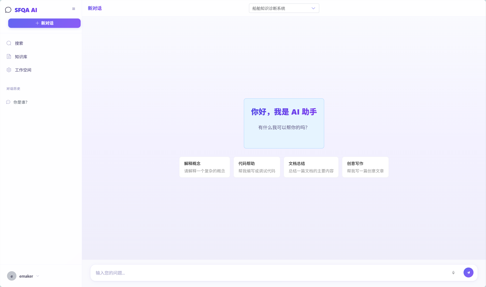

# SFQA - 智能问答系统

<p align="center">
  
</p>

<p align="center">
  <strong>基于 RAG 技术的智能问答系统</strong>
</p>

<p align="center">
  <a href="#功能特性">功能特性</a> •
  <a href="#技术架构">技术架构</a> •
  <a href="#快速开始">快速开始</a> •
  <a href="#安装部署">安装部署</a> •
  <a href="#使用指南">使用指南</a> •
  <a href="#api文档">API文档</a>
</p>

---

## 📖 项目简介

SFQA 是一个基于 **RAG（Retrieval-Augmented Generation，检索增强生成）** 技术的智能问答系统。该系统支持用户上传多种格式的文档构建知识库，通过向量检索和本地大语言模型实现智能问答功能。

### 核心优势

- 🔒 **数据隐私** - 使用本地 Ollama 模型，数据不出境
- 📚 **多格式支持** - 支持 PDF、Word、Excel、Markdown、TXT 等格式
- 🧠 **智能检索** - 结合向量检索与 BM25 算法，精准定位答案
- 💬 **多轮对话** - 支持上下文感知的连续对话
- 🎨 **优雅界面** - 基于 Vue3 + Element Plus 的现代化 UI

---

## ✨ 功能特性

### 1. 知识库管理
- 📁 创建、编辑、删除知识库
- 📤 批量上传文档（支持 PDF、DOCX、XLSX、MD、TXT）
- 📊 文档解析与向量化处理
- 🔍 知识库内容检索与预览

### 2. 智能问答
- 💭 基于 RAG 的智能问答
- 📝 流式输出响应
- 🔗 答案溯源（显示参考文档来源）
- 📜 多轮对话支持
- 💾 对话历史保存与管理

### 3. 模型管理
- 🤖 集成 Ollama 本地大模型
- ⚙️ 支持多种开源模型（Llama、Qwen、Mistral 等）
- 🔧 自定义模型参数配置
- 📈 模型性能监控

### 4. 用户系统
- 👤 用户注册与登录
- 🔐 JWT 身份认证
- 📋 个人知识库管理
- ⚙️ 用户配置管理

### 5. 文档处理
- 📄 PDF 文本与表格提取
- 📝 Word 文档解析
- 📊 Excel 数据处理
- 📖 Markdown 渲染
- 🔄 智能文本分块

---

## 🏗️ 技术架构

### 系统架构图

```
┌─────────────────────────────────────────────────────────────┐
│                        前端层 (Frontend)                      │
│  ┌─────────────┐  ┌─────────────┐  ┌─────────────────────┐  │
│  │  Vue 3      │  │ Element Plus│  │  Pinia State Manage │  │
│  │  Vue Router │  │  Axios      │  │  Highlight.js       │  │
│  └─────────────┘  └─────────────┘  └─────────────────────┘  │
└─────────────────────────────────────────────────────────────┘
                              │
                              ▼
┌─────────────────────────────────────────────────────────────┐
│                        后端层 (Backend)                       │
│  ┌───────────────────────────────────────────────────────┐  │
│  │              Flask RESTful API                        │  │
│  │  ┌──────────┐ ┌──────────┐ ┌──────────┐ ┌──────────┐ │  │
│  │  │  Auth    │ │  Chat    │ │Knowledge │ │  File    │ │  │
│  │  │  Service │ │  Service │ │  Service │ │  Service │ │  │
│  │  └──────────┘ └──────────┘ └──────────┘ └──────────┘ │  │
│  └───────────────────────────────────────────────────────┘  │
│  ┌─────────────┐  ┌─────────────┐  ┌─────────────────────┐  │
│  │  RAG Engine │  │  Vector DB  │  │  MySQL Database     │  │
│  │  (LangChain)│  │  (ChromaDB) │  │  (SQLAlchemy)       │  │
│  └─────────────┘  └─────────────┘  └─────────────────────┘  │
└─────────────────────────────────────────────────────────────┘
                              │
                              ▼
┌─────────────────────────────────────────────────────────────┐
│                        模型层 (Model Layer)                   │
│                    Ollama Local LLM                         │
│              (Llama / Qwen / Mistral ...)                   │
└─────────────────────────────────────────────────────────────┘
```

### 技术栈

| 层级 | 技术 | 说明 |
|------|------|------|
| **前端** | Vue 3 + Vite | 渐进式 JavaScript 框架 |
| | Element Plus | UI 组件库 |
| | Pinia | 状态管理 |
| | Vue Router | 路由管理 |
| **后端** | Flask | Python Web 框架 |
| | SQLAlchemy | ORM 数据库操作 |
| | Flask-JWT-Extended | JWT 认证 |
| | Celery | 异步任务队列 |
| **AI/ML** | LangChain | LLM 应用框架 |
| | ChromaDB | 向量数据库 |
| | Ollama | 本地大模型管理 |
| | Sentence Transformers | 文本向量化 |
| **数据库** | MySQL | 关系型数据库 |
| | Redis | 缓存与消息队列 |
| | ChromaDB | 向量存储 |

---

## 🚀 快速开始

### 环境要求

- Python 3.11+
- Node.js 18+
- MySQL 8.0+
- Redis 6.0+
- Ollama

### 一键启动（推荐）

```bash
# 1. 克隆项目
git clone https://github.com/e-maker51/SFQA.git
cd SFQA

# 2. 启动所有服务（使用 Docker Compose）
docker-compose up -d

# 3. 访问系统
# 前端: http://localhost:5173
# 后端: http://localhost:5000
```

---

## 📦 安装部署

### 方式一：手动安装

#### 1. 安装 Ollama

```bash
# macOS / Linux
curl -fsSL https://ollama.com/install.sh | sh

# Windows
# 下载安装程序: https://ollama.com/download/windows

# 拉取模型
ollama pull qwen2.5:14b
```

#### 2. 配置 MySQL

```sql
CREATE DATABASE sfqa_db CHARACTER SET utf8mb4 COLLATE utf8mb4_unicode_ci;
CREATE USER 'sfqa_user'@'localhost' IDENTIFIED BY 'your_password';
GRANT ALL PRIVILEGES ON sfqa_db.* TO 'sfqa_user'@'localhost';
FLUSH PRIVILEGES;
```

#### 3. 配置 Redis

```bash
# 安装 Redis
# Ubuntu/Debian
sudo apt-get install redis-server

# macOS
brew install redis
brew services start redis

# Windows
# 下载: https://github.com/microsoftarchive/redis/releases
```

#### 4. 后端部署

```bash
# 进入后端目录
cd backend

# 创建虚拟环境
python -m venv venv

# 激活虚拟环境
# Windows
venv\Scripts\activate
# macOS/Linux
source venv/bin/activate

# 安装依赖
pip install -r requirements.txt

# 配置环境变量
cp .env.example .env
# 编辑 .env 文件，配置数据库等信息

# 初始化数据库
flask init-db

# 启动服务
python run.py
```

#### 5. 前端部署

```bash
# 进入前端目录
cd frontend

# 安装依赖
npm install

# 配置环境变量
cp .env.development .env.local

# 开发模式
npm run dev

# 生产构建
npm run build
```

### 方式二：Docker 部署

```bash
# 构建镜像
docker build -t sfqa-backend ./backend
docker build -t sfqa-frontend ./frontend

# 运行容器
docker run -d -p 5000:5000 --name sfqa-backend sfqa-backend
docker run -d -p 80:80 --name sfqa-frontend sfqa-frontend
```

---

## ⚙️ 配置指南

### 后端配置 (.env)

```env
# Flask 配置
FLASK_ENV=development
SECRET_KEY=your-secret-key-here

# JWT 配置
JWT_SECRET_KEY=your-jwt-secret-key
JWT_ACCESS_TOKEN_EXPIRES=86400

# MySQL 数据库
MYSQL_HOST=localhost
MYSQL_PORT=3306
MYSQL_USER=sfqa_user
MYSQL_PASSWORD=your_password
MYSQL_DATABASE=sfqa_db

# Redis
REDIS_HOST=localhost
REDIS_PORT=6379
REDIS_DB=0

# Celery
CELERY_BROKER_URL=redis://localhost:6379/1
CELERY_RESULT_BACKEND=redis://localhost:6379/2

# Ollama
OLLAMA_BASE_URL=http://localhost:11434
```

### 前端配置 (.env.local)

```env
VITE_API_BASE_URL=http://localhost:5000/api
```

---

## 📖 使用指南

### 1. 注册与登录

1. 访问系统首页，点击"注册"按钮
2. 填写用户名、邮箱和密码完成注册
3. 使用注册的账号登录系统

### 2. 创建知识库

1. 进入"知识库"页面
2. 点击"新建知识库"按钮
3. 输入知识库名称和描述
4. 选择要上传的文档文件
5. 等待文档解析完成

### 3. 开始对话

1. 进入"对话"页面
2. 选择要使用的知识库
3. 在输入框中输入问题
4. 系统会基于知识库内容给出答案
5. 可以查看答案引用的文档来源

### 4. 模型管理

1. 进入"模型管理"页面
2. 查看可用的 Ollama 模型
3. 配置模型参数（温度、最大token等）
4. 测试模型连接

---

## 🔌 API 文档

### 认证接口

#### 用户注册
```http
POST /api/auth/register
Content-Type: application/json

{
  "username": "string",
  "email": "string",
  "password": "string"
}
```

#### 用户登录
```http
POST /api/auth/login
Content-Type: application/json

{
  "username": "string",
  "password": "string"
}
```

### 知识库接口

#### 创建知识库
```http
POST /api/knowledge
Authorization: Bearer <token>
Content-Type: application/json

{
  "name": "string",
  "description": "string"
}
```

#### 上传文档
```http
POST /api/knowledge/{id}/files
Authorization: Bearer <token>
Content-Type: multipart/form-data

file: <file>
```

### 对话接口

#### 发送消息
```http
POST /api/chat
Authorization: Bearer <token>
Content-Type: application/json

{
  "knowledge_base_id": "string",
  "message": "string",
  "conversation_id": "string (optional)"
}
```

#### 流式对话
```http
POST /api/chat/stream
Authorization: Bearer <token>
Content-Type: application/json

{
  "knowledge_base_id": "string",
  "message": "string"
}
```

---

## 📁 项目结构

```
SFQA/
├── backend/                    # 后端项目
│   ├── app/
│   │   ├── api/               # API 路由
│   │   ├── loaders/           # 文档加载器
│   │   ├── models/            # 数据模型
│   │   ├── services/          # 业务逻辑
│   │   ├── utils/             # 工具函数
│   │   ├── config.py          # 配置文件
│   │   └── extensions.py      # 扩展初始化
│   ├── database/              # 数据库脚本
│   ├── uploads/               # 上传文件存储
│   ├── vector_db/             # 向量数据库
│   ├── requirements.txt       # Python 依赖
│   └── run.py                 # 启动入口
│
├── frontend/                   # 前端项目
│   ├── src/
│   │   ├── api/               # API 请求
│   │   ├── components/        # 组件
│   │   ├── views/             # 页面视图
│   │   ├── stores/            # Pinia 状态管理
│   │   ├── router/            # 路由配置
│   │   └── utils/             # 工具函数
│   ├── package.json           # Node 依赖
│   └── vite.config.js         # Vite 配置
│
└── README.md                   # 项目说明
```

---

## 🤝 贡献指南

我们欢迎所有形式的贡献，包括但不限于：

- 🐛 提交 Bug 报告
- 💡 提出新功能建议
- 📝 改进文档
- 🔧 提交代码修复
- ✨ 添加新功能

### 贡献流程

1. Fork 本仓库
2. 创建特性分支 (`git checkout -b feature/AmazingFeature`)
3. 提交更改 (`git commit -m 'Add some AmazingFeature'`)
4. 推送到分支 (`git push origin feature/AmazingFeature`)
5. 创建 Pull Request

---

## 📄 许可证

本项目采用 [MIT](LICENSE) 许可证开源。

---

## 🙏 致谢

感谢以下开源项目的支持：

- [Ollama](https://ollama.com/) - 本地大模型管理
- [LangChain](https://langchain.com/) - LLM 应用框架
- [ChromaDB](https://www.trychroma.com/) - 向量数据库
- [Vue.js](https://vuejs.org/) - 前端框架
- [Flask](https://flask.palletsprojects.com/) - 后端框架

---

## 📞 联系我们

- 📧 邮箱: contact@sfqa.example.com
- 💬 Issues: [GitHub Issues](https://github.com/e-maker51/SFQA/issues)
- 🌐 项目主页: https://github.com/e-maker51/SFQA

---

<p align="center">
  Made with ❤️ by SFQA Team
</p>
